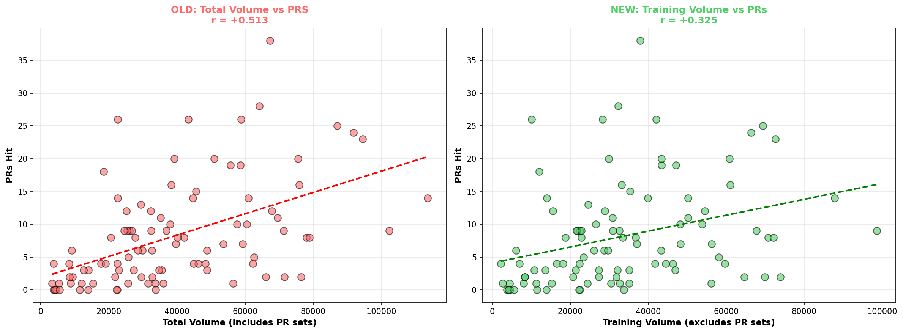
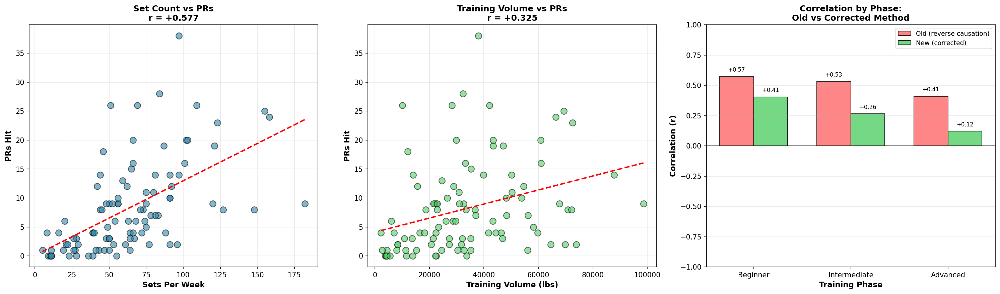
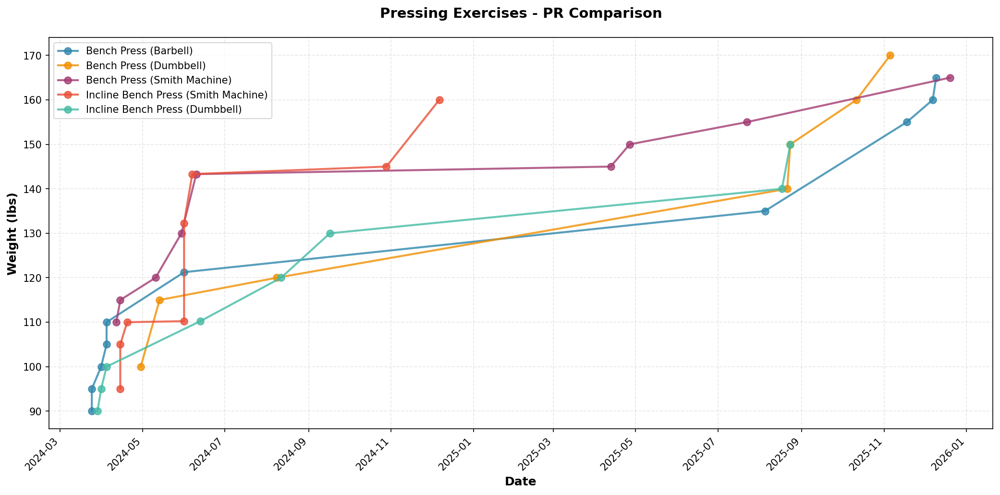

# Strength Training Analytics

Analyzed 6,000+ self-collected workout sets across 98 weeks to find what actually drives strength progress. The main finding: the initial volume-PR correlation (+0.513) was inflated by two separate biases, and correcting for them changed the conclusion.

## Key Findings

**Volume-PR correlation was overstated.** The naive correlation between weekly training volume and PRs was +0.513. After correcting for reverse causation (PR sets inflating volume calculations) and stratifying by training phase, the true correlation dropped to +0.325.

**Set frequency is a stronger predictor than total volume.** Weekly set count correlated at +0.577 with PRs, compared to +0.325 for corrected volume.

**Beginner gains confound the full-dataset analysis.** The volume-PR correlation in the advanced phase (12+ months) drops to +0.121. Most of the apparent relationship was driven by rapid early progress, not by volume itself.

**96% of training falls in two rep ranges.** The 4-6 rep range accounts for 52% of all sets and 7-12 accounts for 44%, with almost no work in the 1-3 or 13+ ranges.

## Selected Visualizations

### Reverse Causation Correction
Side-by-side comparison of the naive vs. corrected volume-PR correlation:



### Volume Analysis Summary
Set frequency vs. PRs, corrected volume vs. PRs, and correlation breakdown by training phase:



### Pressing Movement PR Progression
Five pressing variants tracked over time:



## Project Structure

```
├── data/
│   └── workout_data.csv              # 6,137 sets, 101 exercises, 14 columns
├── scripts/
│   ├── pr_tracker.py                 # Find max weight per exercise
│   ├── pr_tracker_v2.py              # Add datetime tracking and PR timelines
│   ├── visualizer.py                 # PR progression and exercise comparison charts
│   ├── volume_analysis.py            # Weekly volume trends and volume-PR correlation
│   ├── volume_analysis_v2.py         # Stratified analysis by training phase
│   ├── volume_analysis_v3.py         # Reverse causation correction and lagged effects
│   └── rep_range_analysis.py         # Rep range categorization and estimated 1RM tracking
├── visualizations/                   # All generated charts
├── outputs/
│   └── my_prs.csv                    # Exported PR data
└── README.md
```

### Script Evolution

The version files are kept intentionally. Each version identified a flaw in the previous approach:

**volume_analysis.py** calculated a naive volume-PR correlation of +0.513 and treated it at face value.

**volume_analysis_v2.py** stratified by training phase (beginner/intermediate/advanced) to test whether beginner gains were inflating the result. They were.

**volume_analysis_v3.py** corrected for reverse causation by separating PR sets from training volume. PRs are heavy lifts that spike volume, so including them on the "cause" side of the correlation was circular. Removing them dropped the correlation from +0.513 to +0.325. This version also tested lagged effects (does last week's volume predict this week's PRs?) and found the relationship was weak (+0.135).

## Methods

**Estimated 1RM** was calculated using the Epley formula: `e1RM = weight * (1 + reps / 30)`. This normalizes strength across rep ranges so that sets at different weights and reps can be compared on the same scale.

**Data cleaning:** Reps were capped at 18 after identifying misinputs (e.g., 69 lateral raises, 47 leg extensions) that produced unrealistic e1RM values. Warmup sets were excluded from all analysis.

## Tech Stack

Python, pandas, matplotlib, NumPy, Git

## Running the Scripts

```bash
cd scripts
python pr_tracker.py           # Basic PR detection
python pr_tracker_v2.py        # PR timeline analysis
python visualizer.py           # Generate progression charts
python volume_analysis.py      # Volume trends and correlation
python volume_analysis_v3.py   # Corrected analysis
python rep_range_analysis.py   # Rep range categorization and e1RM
```

Requires: `pandas`, `matplotlib`, `numpy`

```bash
pip install pandas matplotlib numpy
```
